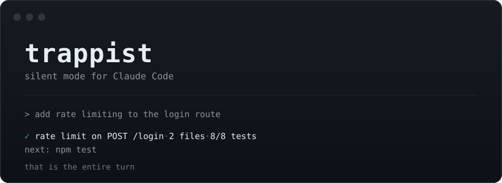

# trappist

A Claude Code plugin that removes progress narration, repeated summaries, and follow-up offers. Completed work ends with a short receipt. Questions, warnings, errors, and incomplete work still receive an explanation.



## Installation

```bash
claude plugin marketplace add nohseongmin/claude-code-silent-mode
claude plugin install trappist@trappist
```

Requires Node 18 or later. The plugin becomes active at the next session start. Requests such as "results only" or "no commentary" enable it; "normal mode" disables it. English and Korean activation phrases are supported.

| Command | Output |
|---|---|
| `/trappist` | Receipt only, the default full level |
| `/trappist lite` | Receipt and up to two lines of explanation |
| `/trappist ultra` | One-line receipt |
| `/trappist off` | Normal output |

The level persists across sessions. Set `TRAPPIST_MODE=off` to opt out globally.

## Receipt format

```text
<success marker> <what happened> · <files touched> · <check result>
next: <one command>
```

For example:

```text
<success marker> rate limit on POST /login · 2 files · 8/8 tests
next: npm test
```

The `next:` line is omitted when nothing remains to run. Checks must have actually run; otherwise the receipt says `unverified`.

The success marker is U+2713 in the plugin's receipt syntax. The plugin shortens chat output; code, commits, pull-request descriptions, and requested documents are written in full.

## Exceptions

The plugin explains destructive or irreversible actions before confirmation, exposed secrets and security risks, failures, incomplete or skipped work, real errors, and blocking ambiguity. It also answers direct questions. A short receipt never justifies skipping validation or error handling.

## Measuring output

```bash
node tools/measure.js
```

The tool reads local transcripts from `~/.claude/projects`. Use `--json` for machine-readable output or `--dir` for a different directory. Nothing is uploaded.

The recorded analysis covered 220 sessions, 716 turns, and 19,330 assistant messages:

| Measure | Value |
|---|---:|
| Visible output tokens | 16,147.5k |
| Excluded thinking tokens | 3,302.1k |
| Prose | 5,608.9k, or 34.7% |
| Tool-use output | 10,538.6k, or 65.3% |
| Median prose per turn | 3,042 tokens |
| Assumed receipt size | 25 tokens |
| Simulated maximum saving | 5,591.8k tokens, or 34.6% |

The total output counts come from billed transcript usage. The split between text and tool-use blocks is estimated in proportion to serialized character count.

The saving is a simulation: narration is removed and final messages are replaced by 25-token receipts. It is an upper bound, not a measured improvement from running the plugin. Real sessions retain warnings, questions, and failure reports. Only 19 of the 228 source transcripts had caveman active.

Repeated input billing from replayed messages is excluded. Use a session A/B comparison with `/cost` to measure your own results.

## Implementation

Two hooks, a skill file, and about 140 lines of Node without dependencies:

- `SessionStart` injects [SKILL.md](skills/trappist/SKILL.md), filtered to the selected level.
- `UserPromptSubmit` handles commands and activation phrases, stores the level in `~/.claude/.trappist-mode`, and repeats a short reminder each turn.

The reminder costs about 50 input tokens. The stored mode is read through an allowlist so file contents cannot inject arbitrary instructions.

## Other agents and chat apps

| Environment | Instructions |
|---|---|
| ChatGPT, claude.ai, or other chat apps | Paste [prompts/chat.md](prompts/chat.md) into custom or project instructions. |
| claude.ai skills, where available | Upload [skills/trappist/](skills/trappist/). |
| Cursor, Codex, Cline, or Copilot | Use [AGENTS.md](AGENTS.md) as repository instructions. |

The chat prompt omits work receipts because the answer itself is the deliverable.

Related projects: [caveman](https://github.com/JuliusBrussee/caveman) for concise prose and [ponytail](https://github.com/DietrichGebert/ponytail) for minimal code.

## Development

```bash
npm test
```

## License

MIT.
